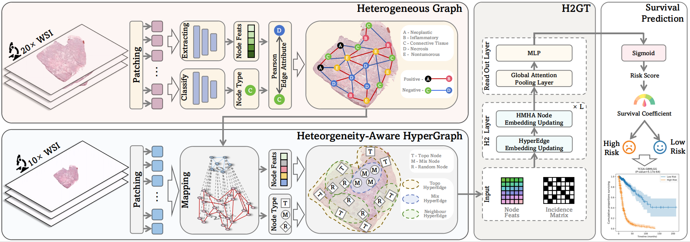

# Multi-Scale Heterogeneity-Aware Hypergraph Representation for Histopathology Whole Slide Images
Pytorch implementation for the Heterogeneous Hypergraph Representation learning in the paperMulti-Scale Heterogeneity-Aware Hypergraph Representation for Histopathology Whole Slide Images.


## Installation
a. Create a conda virtual environment and activate it.

```shell
conda create -n H2GT python=3.9 -y
conda activate H2GT
```

b. Install PyTorch and torchvision following the [official instructions](https://pytorch.org/), e.g.,

```shell
conda install pytorch torchvision -c pytorch
```

c. Install other libraries.

- Install [OpenSlide and openslide-python](https://pypi.org/project/openslide-python/).  
[Tutorial 1](https://openslide.org/) and [Tutorial 2 (Windows)](https://www.youtube.com/watch?v=0i75hfLlPsw).  


- Install dgl
  ```shell
  pip install  dgl -f https://data.dgl.ai/wheels/cu118/repo.html
  pip install  dglgo -f https://data.dgl.ai/wheels-test/repo.html
  ```


## Stage 1: Data pre-processing
Please refer to [CLAM](https://github.com/mahmoodlab/CLAM/tree/master) for data pre-processing.

Data pre-processing: Download the raw WSI data and Prepare the patches.


## Stage 2: Construct heterogeneous hypergraph
The aggregator is firstly trained with bag-level labels end to end.

```
python construct_hypergraph.py --config /path/to/the/config
```
## Stage 3: Training
For different methods, we pre-set their config files in folder [configs](configs).
```
python main.py --config /path/to/the/config
```

<!-- ## Citing IBMIL
```
@inproceedings{lin2023interventional,
  title={Interventional bag multi-instance learning on whole-slide pathological images},
  author={Lin, Tiancheng and Yu, Zhimiao and Hu, Hongyu and Xu, Yi and Chen, Chang-Wen},
  booktitle={Proceedings of the IEEE/CVF Conference on Computer Vision and Pattern Recognition},
  pages={19830--19839},
  year={2023}
}
``` -->
